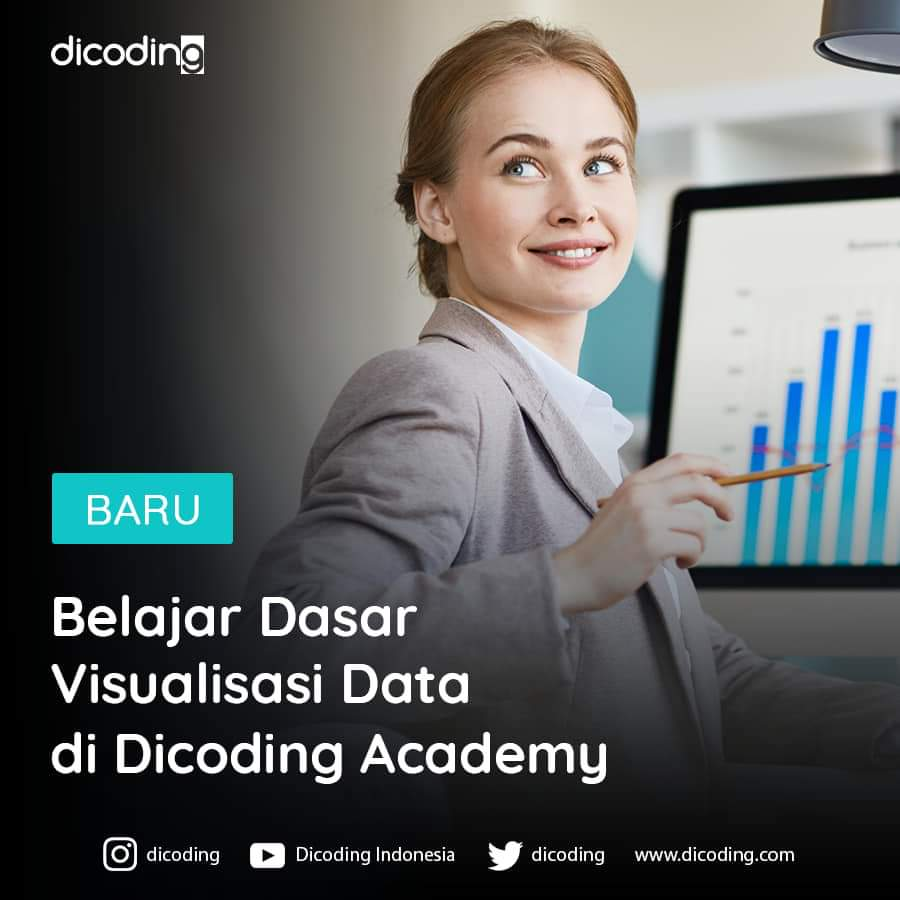
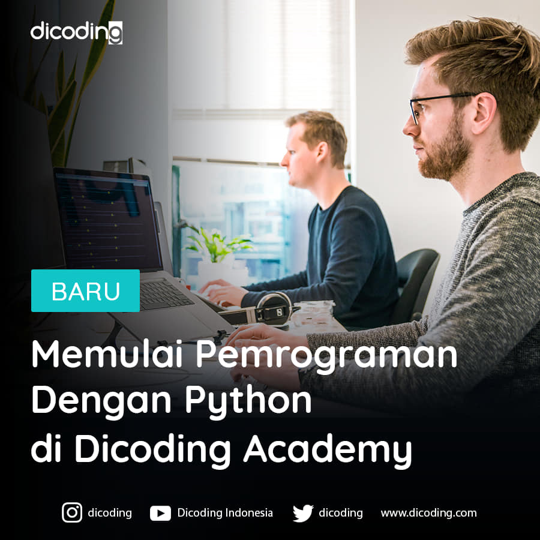
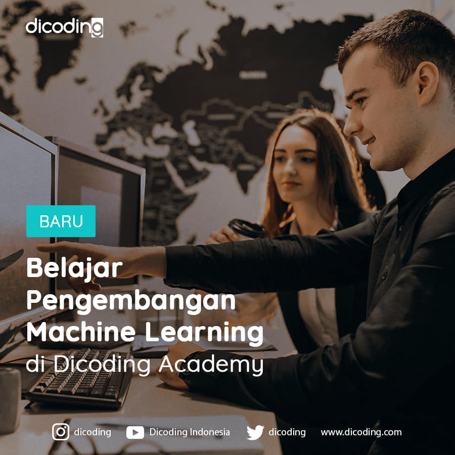
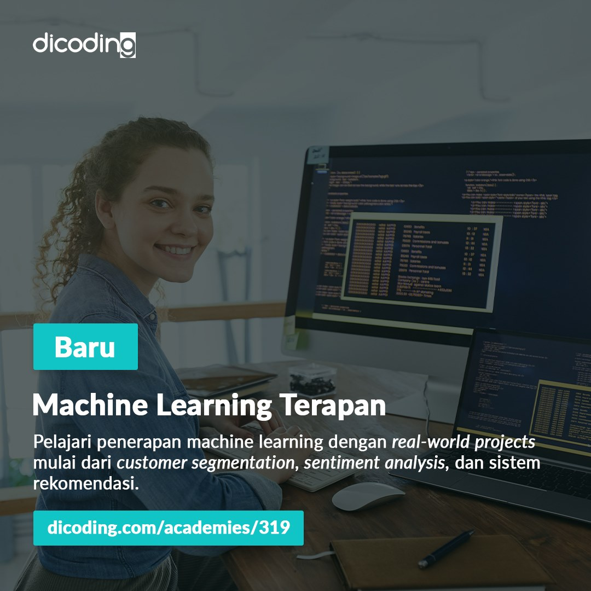

[<h1 align="center">Machine Learning Developer</h1>](https://www.dicoding.com/learningpaths/30)

  

Seorang Machine Learning Developer adalah pakar dalam menggunakan data untuk model pelatihan. Model-model tersebut kemudian digunakan untuk mengotomatisasi proses seperti klasifikasi gambar, pengenalan suara, dan perkiraan pasar. Sering kali ada penggabungan dengan peran data scientist atau artificial intelligence (AI) engineer. Machine learning adalah subbidang AI yang berfokus pada analisis data untuk menemukan hubungan antara input dan output yang diinginkan. Seorang pengembang pemelajaran mesin harus mampu menghasilkan solusi yang dibuat khusus untuk setiap masalah dan mencapai hasil optimal dengan hati-hati memproses data dan memilih algoritma terbaik untuk konteks yang diberikan.

Kurikulum Machine Learning di Dicoding telah dikembangkan langsung bersama IBM dan Google menggunakan kurikulum resmi dari masing-masing perusahaan. Setiap langkah dalam learning path ini telah didesain agar siswa dapat memiliki pengetahuan yang cukup untuk menjadi seorang Machine Learning Developer yang dapat memenuhi kebutuhan industri.

Modul

 

01. Belajar Dasar Visualisasi Data

 

Pelajari teknik dasar untuk representasi hasil secara visual sehingga dapat menceritakan dan mempresentasikan data secara efektif.

### Silabus

- **Pendahuluan** : Pengenalan tentang definisi visualisasi data, media visualisasi data, tools dalam visualisasi data, dan konteks data. (1 jam 39 menit)
Persiapan
- **Data Pra-Visualisasi** : Pengenalan tentang tools aplikasi spreadsheet menggunakan Google Sheets mulai dari navigasi hingga fungsi-fungsi yang bisa digunakan untuk mengolah data.
- **Transformasi Data ke Visual** : Cara untuk mengubah data menjadi bentuk grafik, kesalahan umum dalam visualisasi data, pentingnya dokumentasi data, bagaimana cara bercerita dengan data, dan praktek terbaik dalam visualisasi yang efektif seperti prinsip Gestalt, konsep Preattentive Attributes, dan konsep teori desain.
- **Penutup** : Bagaimana visualisasi data digunakan dalam dunia pemrograman sehingga terlihat jelas langkah berikutnya yang dapat ditempuh siswa.

02. Memulai Pemrograman Dengan Python

 

Belajar Python yang menjadi landasan penting berbagai tren industri seperti ilmu data, pemelajaran mesin, dan manajemen infrastruktur.

### Silabus

- **Pendahuluan** : Pengenalan mengenai bahasa Python dan cara instalasi-nya.
- **Dasar Python** : Menjelaskan mode operasi dan style guide penulisan pada Python.
- **Tipe Data pada Python** : Menjelaskan tipe data pada Python, seperti Number, String, List, dan Set.
- **Input/Output dan Operasi pada Python** : Menjelaskan mekanisme input/output pada Python, dan juga operasi pada Python seperti operasi pada list, manipulasi string, operator, operands, dan expression.
- **Style Guide pada Python** : Menjelaskan style guide pada Python, PEP8, formatting kode, statement gabungan, dan prinsip penamaan.
- **Control Flow** : Menjelaskan flow control pada Python, percabangan dan perulangan.
- **Penanganan Kesalahan** : Menjelaskan cara menangani kesalahan ketika terjadi kesalahan syntax atau pengecualian di Python.
- **Fungsi dan Method** : Menjelaskan fungsi dan method pada Python, argument, dan parameter.
- **Pemrograman Berorientasi Objek** : Menjelaskan pemrograman berorientasi objek pada Python seperti object, class, method, inheritance, dan implementation.
- **Unit Testing** : Memahami teknik pengujian program secara otomatis pada Python dengan unit testing beserta contoh implementasinya.
- **Library Populer** : Mempelajari beberapa library populer pada Python seperti String, OS, Pickle, JSON, Scrapper, Regex, dan Argument Parser.

03. Belajar Machine Learning untuk Pemula

 

Pelajari materi dasar pengembangan machine learning dan langkah menciptakan model machine learning pertamamu untuk memproses data.

### Silabus

- **Pengenalan Data** : Pengenalan ke machine learning dan teknik-teknik untuk pengolahan data, seperti data collecting, data cleaning, dan data processing.
- **Supervised dan Unsupervised Learning** : Memahami 2 jenis machine learning yaitu supervised dan unsupervised learning, dengan contoh model regresi linear dan decision tree.
- **Support Vector Machine (SVM)** : Menjelaskan tentang SVM, salah satu model machine learning yang populer. Di sini juga akan belajar tentang clustering dengan k-means.
- **Dasar-Dasar Machine Learning** : Menjelaskan tentang alur kerja (workflow) dari suatu proyek machine learning, dan juga menjelaskan overfitting, underfitting, dan model selection.
- **Neural Network** : Belajar mengenal dasar dari neural network. Akan diterangkan mengenai multi layer perceptron serta convolutional neural network dalam image classification.
- **TensorFlow** : Belajar tentang library TensorFlow, sebuah powerful library yang dipakai untuk mengembangkan project machine learning. (4 jam 5 menit)

04. Belajar Pengembangan Machine Learning

 

Pelajari implementasi machine learning pada industri mulai dari computer vision, natural language, serta deployment proyek machine learning.

### Silabus

- **Problem Framing** : Mempelajari bagaimana merumuskan solusi machine learning untuk suatu masalah.
- **Membuat dan Melatih Model Neural Network dengan Keras and TensorFlow** : Belajar mengembangkan model dengan format data berbeda, membuat plot akurasi dan loss dari model, penggunaan callback, TensorFlow dataset, dan batch loading.
- **Sistem Rekomendasi** : Mengenal teknik yang dipakai dalam sistem rekomendasi seperti collaborative dan content based filtering, serta sistem rekomendasi menggunakan jaringan saraf.
- **Natural Language Processing (NLP) dengan TensorFlow** : Belajar mengolah kata menggunakan TensorFlow.
- **Time Series** : Belajar mengembangkan model untuk prediksi data time series.
- **Reinforcement Learning** : Teknik melatih model berdasarkan teori hadiah dan hukuman, menggunakan Keras, game playing agent, serta algoritma minimax.
- **Deployment** : Menjelaskan bagaimana men-deploy model machine learning ke aplikasi website dan Android dengan menggunakan TensorFlow.

05. Machine Learning Terapan

 

Pelajari penerapan machine learning dengan real-world projects mulai dari predictive analytics, sentiment analysis, dan sistem rekomendasi.

### Silabus

- **Machine Learning System Design** : Mempelajari tahapan-tahapan dalam menyusun sistem machine learning dan memahami desain sistem machine learning.
- **Menyusun Proyek Machine Learning** : Mempelajari bagaimana tahapan dalam menyusun proyek machine learning, mampu mengomunikasikan dan memublikasikan proyek machine learning untuk membangun portofolio.
- **Studi Kasus Pertama terkait Predictive Analytics** : Mempelajari algoritma k-Nearest Neighbor, Random Forest, dan AdaBoost serta penerapannya untuk kasus predictive analytics.
- **Studi Kasus Kedua tentang Analisis Sentimen** : Mempelajari bagaimana membuat model analisis sentimen dengan teknik Deep Learning dan Support Vector Machine.
- **Studi Kasus Ketiga dengan topik Computer Vision** : Mempelajari teknik computer vision untuk pengenalan gambar dan deteksi objek pada gambar.
- **Studi Kasus Keempat mengenai Sistem Rekomendasi** : Mempelajari metode yang digunakan dalam Sistem Rekomendasi serta mampu membuat proyek Sistem Rekomendasi.

 

Project

 

01. Belajar Dasar Visualisasi Data

02. Memulai Pemrograman Dengan Python

03. Belajar Machine Learning untuk Pemula

  
- [**Proyek Akhir : Klasifikasi Gambar**](https://github.com/tonishndr/Machine-Learning-Developer/blob/main/Belajar%20Machine%20Learning%20untuk%20Pemula/Proyek-Akhir%20-Klasifikasi-Gambar.ipynb)

04. Belajar Pengembangan Machine Learning

  
- [**Proyek Pertama : Membuat Model NLP dengan TensorFlow**](https://github.com/tonishndr/Machine-Learning-Developer/blob/main/Belajar%20Pengembangan%20Machine%20Learning/Proyek-Pertama-Membuat-Model-NLP-dengan-TensorFlow.ipynb)
- [**Proyek Kedua : Membuat Model Machine Learning dengan Data Time Series**](https://github.com/tonishndr/Machine-Learning-Developer/blob/main/Belajar%20Pengembangan%20Machine%20Learning/Proyek-Kedua-Membuat-Model-Machine-Learning-dengan-Data-Time-Series.ipynb)
- [**Proyek Akhir : Image Classification Model Deployment**](https://github.com/tonishndr/Machine-Learning-Developer/blob/main/Belajar%20Pengembangan%20Machine%20Learning/Proyek-Akhir-Image-Classification-Model-Deployment.ipynb)
  

05. Machine Learning Terapan

   

